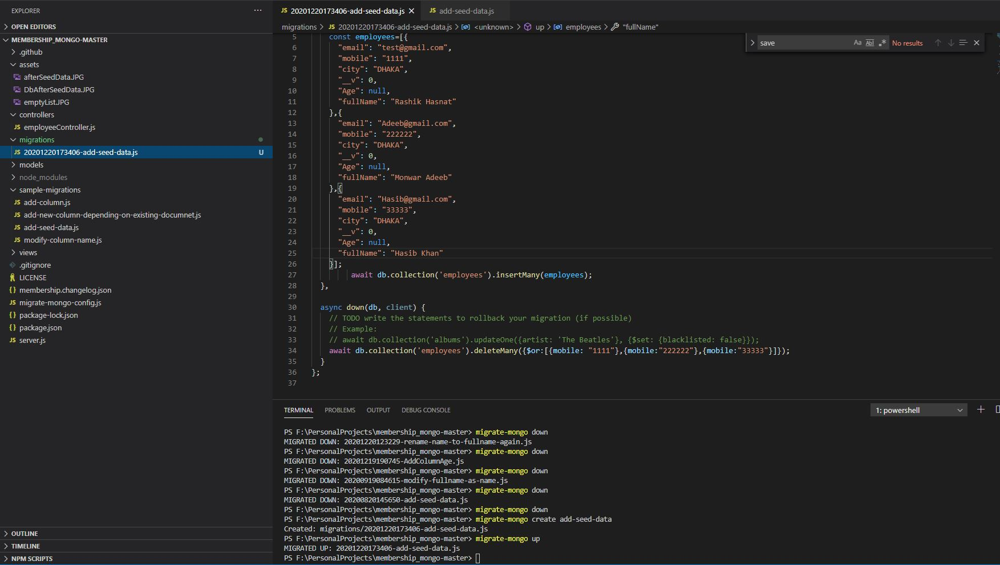
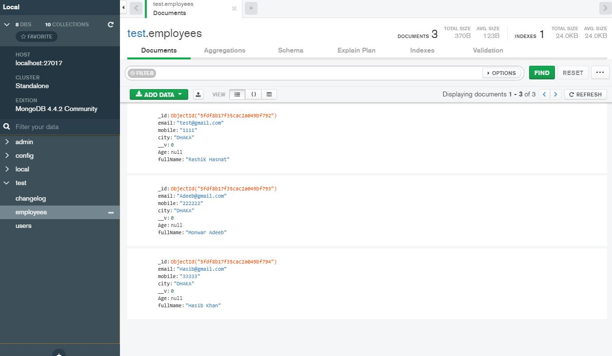
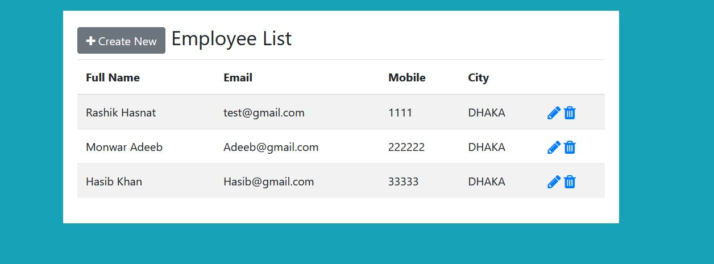

# Mongodb database migration on top of nodejs and express js

This is a test project to test how nodeJs migration works with [migrate-mongo].(https://github.com/seppevs/migrate-mongo#readme)
 
 ## Running The GUI
 * I'm assuming you have mongo db installed in your computer without any password. this program uses the local mongodb. If you want to change that, please change the file [db.js].(https://github.com/Rashik004/node_mongo_migrator/blob/master/models/db.js)
* Run these commands serially after you download/clone the repository

        npm install
        nodemon server.js
        npm start
Once the server is successfully started, you should see a log like below:

		Express server started at port : 3000
		MongoDB Connection Succeeded.
		
* Go to url http://localhost:3000/employee/list and you should see a page like below: 

    
You can add new data by clicking create new or just run the seed data migration to add data.

## Running the migrations
First you need to create a migration file, to create migration file, go to powershell terminal and write following command:

		migrate-mongo [you-migration-name]

A new file will be created starting with the creation timestamp and followed by migration name. in this new file you can copy paste code from one of the files from sample-migrations directory.

for example:
The newly added migration:

after adding the migration run this command:

		migrate-mongo up
new data will be added in the database.

database after running this command:

list page command after running the migration:

other migrate-mongo commands to explore:

		migrate-mongo status
		migrate-mongo down

**Please see the [sample-migrations](https://github.com/Rashik004/node_mongo_migrator/tree/master/sample-migrations) folder for further examples.**

